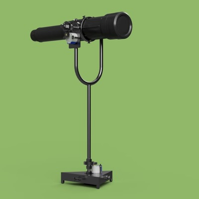

# SkyTracker Telescope System

The SkyTracker Telescope System is a project aimed at developing a telescope control system that can lock onto a specific point in the sky (like a star or planet) and continue to track it as Earth rotates on its axis.

## Features

- Two-axis movement system for robust positioning.
- Remote control from Android app via Bluetooth.
- Precision control with stepper motors.
- Core controller built around the Atmega 32A microcontroller.
- Bluetooth connectivity with HC-06 module.

## Implementation Details

The SkyTracker Telescope System utilizes a two-axis movement system to precisely point the telescope to specific coordinates in the sky. The system is driven by stepper motors for fine-grained control. 

The system is controlled by an Atmega 32A microcontroller, responsible for controlling the stepper motors and processing the inputs from the Android app. 

The Android app communicates with the Atmega 32A microcontroller via a Bluetooth connection, using the HC-06 Bluetooth module. The app provides an intuitive interface for the user to select the target for the telescope.

## Device Images

## Getting Started

### Prerequisites
- Android device with Bluetooth functionality.
- Telescope with a two-axis movement system.

### Installation
1. Download the Android application.
2. Install the app on your Android device and launch it.
3. Power on the SkyTracker control system.
4. Establish a Bluetooth connection with the device named "Telescope".
5. Use the joystick to manually adjust the position of the telescope or select a star from the database.
6. Enjoy your stargazing!

## Contact
Please feel free to reach out to us for any questions, suggestions, or feedback. For contact information, please refer to the 'Contact' section of the repository or email feodosiy2404@gmail.com.
